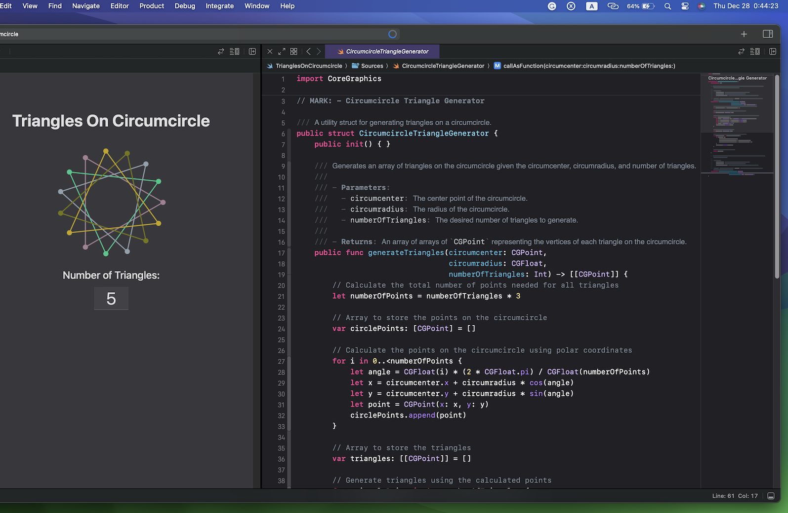

# Triangles on Circumcircle

This app generates `equilateral triangles` with a common center on a coordinate plane.
Triangles are created with equal spacing between their vertices.


## Table of Contents

- [Overview](#overview)
- [Features](#features)
- [Code Structure](#code-structure)
- [How To Use](#how-to-use)
- [Dependencies](#dependencies)
- [Sample API](#sample-api)
- [Contributing](#contributing)
- [License](#license)

## Overview

It provides a simple and intuitive interface to visualize and create equilateral triangles. The triangles are arranged with equal spacing between their vertices, creating an elegant geometric pattern on the coordinate plane.

<p>  </p>

## Features

- **Dynamic Visualization**: Input the number of triangles you want, and see them dynamically generated on the coordinate plane.
- **Real-time Updates**: The app updates in real-time as you change the number of triangles, providing instant visual feedback.
- **User Interaction**: The user interface allows for easy interaction, with a text field for input and immediate display updates.

## Code Structure

The main code file is [FileName.swift], which contains the following key components:

- **Load Nib File**: Loading the interface from a Nib file.
- **Global Properties**: Declaration of global variables, including the circumcenter and coordinate plane view.
- **Setup Views**: Initializing and setting up views, including the calculation of the circumcenter.
- **Methods**: Function to refresh the display of triangles on the coordinate plane.
- **Text Field Value Did Change**: Handling changes in the text field and updating the display accordingly.
- **Circumcircle Triangle Generator**: A utility struct to generate triangles on a circumcircle.



## How to Use

1. Launch the app.
2. Input the desired number of triangles in the provided text field.
3. The app will display the triangles on the coordinate plane, with a common center.


## Dependencies

This app is built using **Cocoa**, **AppKit** and relies on the **CoreGraphics** framework.

## Sample API

```swift
// Example code to use the CircumcircleTriangleGenerator
let circumcircleTriangleGenerator = CircumcircleTriangleGenerator()
let triangles = circumcircleTriangleGenerator(circumcenter: CGPoint(x: 100, y: 100),
                                              circumradius: 50,
                                              numberOfTriangles: 5)
```

## Contributing

Contributions are more than welcome :)


## License
 
See the [LICENSE](LICENSE) file for details.
